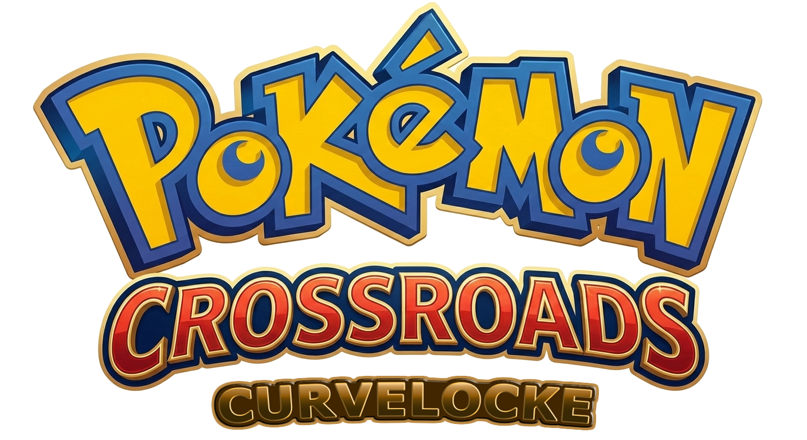

<p align="center">
  
</p>

# Pokémon Crossroads Curvelocke

**Pokémon Crossroads Curvelocke** is a fork of [Pokémon Crossroads Beta 1.4](https://github.com/eonlynx/pokecrossroads), a ROM hack of *Pokémon Emerald* developed by the Crossroads Dev Team.

This fork adds the **Curvelocke** challenge ruleset on top of Crossroads, plus a suite of quality-of-life modifications. It does not change trainers, encounters, Pokémon, moves, abilities, story, or maps — Crossroads is left intact. Curvelocke is purely a set of mechanical modifications.

> Upstream Crossroads README is preserved in commit history. For the original project — story, regions, dev team, contributing — visit the [main repository](https://github.com/eonlynx/pokecrossroads).

---

## What is Curvelocke?

Curvelocke is a challenge mode where **wild Pokémon weaker than yours grant no experience**. The goal is to remove grinding as a problem-solving tool and force the player to plan: pick the right trainer fights, manage party levels, build teams that can handle what's in front of them.

I first tried Curvelocke on Pokémon Crystal and quickly ran into a softlock — running out of XP sources in a linear region with no way to backtrack to fresh trainers. Looking for a more open-world Pokémon experience that wouldn't dead-end the run, I found **Crossroads**: three connected regions (Hoenn, Kanto, Sevii) with PokéCenter cross-map jumps that keep trainer fights plentiful no matter where you are. A natural fit.

---

## The Curvelocke rule

**No-grind XP.** A defeated wild Pokémon whose level is **strictly lower than** the recipient's level grants **zero XP**.

- Checked per-recipient (active battler and any EXP Share recipient evaluated independently).
- **Trainer battles are unaffected** — trainers remain the player's legitimate XP source.
- Catching a Pokémon follows the same rule.

That's the entire challenge. Everything else in this fork is QoL.

---

## Crossroads tweaks for Curvelocke

Small adjustments to Crossroads' base content that keep the no-grind rule playable from a fresh save.

- **Starter STAB at lv6** — Pokémon Crossroads uses Gen 9 / Scarlet-Violet learnsets game-wide, which gave most starters their primary-type damaging move at lv3-4 and made the first rival fight unwinnable under the no-grind rule. All nine starters (Hoenn, Kanto, Johto) now learn their STAB at lv6, mirroring the Johto trio's schedule. The first rival's lv5 starter also no longer has STAB, restoring Route 103 to a clean stat check.
- **Starter IVs floored at 15** — every IV on the starter rolls in [15, 31] instead of [0, 31], preserving run-to-run variance while preventing softlocks from a bad-roll starter.

---

## Quality-of-life modifications

These are independent of the Curvelocke challenge — tweaks to make the game feel responsive enough that you don't need an emulator speed multiplier.

### Press B to skip wild encounters
During the wild encounter transition animation, **hold B** to cancel the battle and return to the overworld — *if* your lead follower Pokémon outspeeds the wild one.
- Speed gate uses the follower's actual battle Speed stat (level + IVs + EVs + nature + items). Strict greater-than; equal speed means no skip.
- The follower is the first alive non-egg party member — reorder your party to choose your "scout."
- **Exempt** (always unskippable): roaming legendaries, fishing encounters, scripted/static encounters.

### Other QoL tweaks

| QoL | Change |
|---|---|
| **Modern EXP Share toggle** | Adds an EXP Share entry to the Options menu. When **ON**, every alive non-egg party member shares XP (Gen 6+ behavior). When **OFF** (default for new games), XP behaves like vanilla Crossroads. Toggle freely at any time. |
| **Faster overworld movement** | Walking ~1.78×, running and biking ~1.25× faster than vanilla. Animations rescaled to match. |
| **Skip battle intro slide** | The slide-in animation at the start of every battle is skipped. |
| **Halved warp fades** | Door and map transitions fade in/out twice as fast. |
| **Snappier menus, fades, and battle transitions** | Start menu opens in one frame; party/bag/menu-selection fades twice as fast; trainer-spot "!" cuts from 52 to 20 frames; battle gray-flash twice as fast. |
| **Text speed: Fast / Instant only** | The Options "TEXT SPEED" row drops Slow/Mid; only Fast and Instant remain. |
| **Shorter post-save confirmation** | "{PLAYER} saved the game!" auto-dismisses after ~0.33s instead of ~1s. A button still skips early; the safety "don't turn off" message during the actual write is preserved. |
| **2× PC box navigation** | Cursor movement and box-scroll speed doubled in the PC. |

---

## How to play

There are **no pre-built patches or releases** for this fork — please support the upstream Crossroads team by [playing their official release](https://github.com/eonlynx/pokecrossroads/releases).

If you specifically want to try the Curvelocke ruleset on top of Crossroads, you can build the ROM from source — see below.

---

## Building from source

This fork is built directly on Crossroads Beta 1.4 (`e05c8286`). The Crossroads build chain is preserved unchanged.

```bash
git clone https://github.com/impigro/pokecrossroads_curvelocke.git
cd pokecrossroads_curvelocke
make modern -j$(nproc)
```

Output: `pokeemerald.gba` in the project root.

Requires devkitARM (15.2.0 is known good). See upstream Crossroads' [INSTALL.md](INSTALL.md) for full toolchain setup.

---

## Credits

See [CURVELOCKE_CHANGELOG.md](CURVELOCKE_CHANGELOG.md) for a full list of changes per patch.

Curvelocke Crossroads stands on the work of many others.

- **[Pokémon Crossroads](https://github.com/eonlynx/pokecrossroads)** — eonlynx, justgoose, and the Crossroads Dev Team. The base ROM hack this fork is built on.
- **[pokeemerald-expansion](https://github.com/rh-hideout/pokeemerald-expansion)** — rh-hideout. The engine Crossroads is built on, which already includes the Gen 6+ EXP Share plumbing this fork hooks into.
- **pret** — the pokeemerald decompilation that makes all of this possible.
- **Crossroads' upstream credits** (cawtds, AsparagusEduardo, @h y o, and the broader decompilation community) carry over in full — see the [original Crossroads README](https://github.com/eonlynx/pokecrossroads/blob/main/README.md).

---

## License

This is a personal fork. Upstream Crossroads ships without a formal license, so this fork carries no formal license either — do what you want with the code. The polite ask: if you want to play Pokémon Crossroads, get it from the [official Crossroads repository](https://github.com/eonlynx/pokecrossroads) and support the original developers.

---

## Reporting bugs

Curvelocke-specific bugs (XP rule, encounter skip, EXP Share toggle, QoL mods): open an issue on this fork.

Crossroads bugs: report upstream at [eonlynx/pokecrossroads/issues](https://github.com/eonlynx/pokecrossroads/issues).
